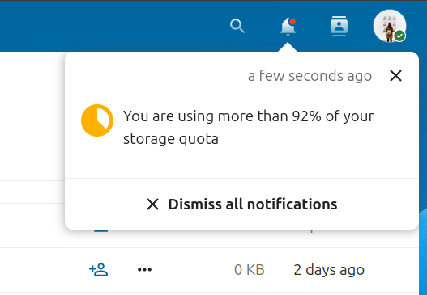
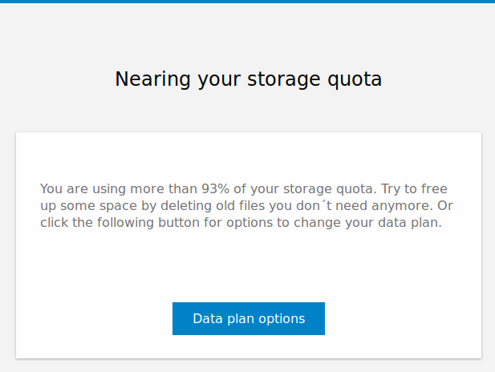
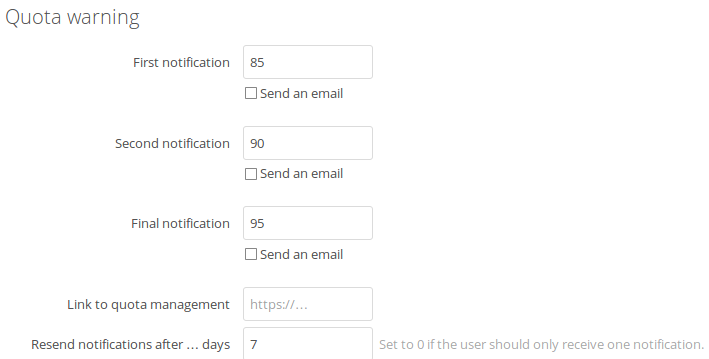

# ❗💾 Quota warning

This app sends notifications to users when they reached 85, 90 and 95% of their quota (checked once a day).
In addition an email can be sent to the users. The three percentages can be changed in the admin settings.
It is also possible to have a link in the email and the notification for upsell options.

### Notification

> 

### Email

> 

### Admin settings

> 
